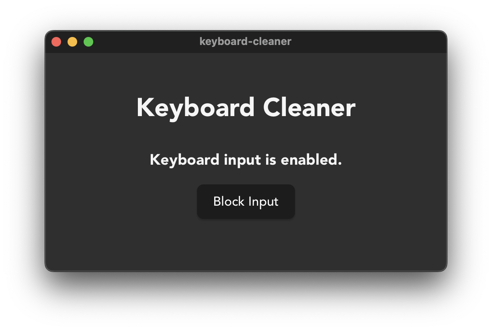

# Keyboard Cleaner

Keyboard Cleaner is a cross-platform desktop application built with Rust and Tauri. It allows users to temporarily disable keyboard input, making it easy to clean your keyboard without accidentally triggering any keys.

# Support

-   macos

## Features



-   Temporarily disables all keyboard input for safe cleaning
-   Simple and intuitive user interface
-   Lightweight and fast, thanks to Rust and Tauri

## Permissions

This app requires permission in `System Settings > Privacy & Security > Accessibility` to block keyboard events.

## Getting Started

### Prerequisites

-   [Rust](https://www.rust-lang.org/tools/install)
-   [Node.js](https://nodejs.org/) (for Tauri frontend)
-   [Tauri CLI](https://tauri.app/v1/guides/getting-started/prerequisites/)

### Installation

Clone the repository:

```bash
git clone https://github.com/yourusername/keyboard-cleaner-tauri.git
cd keyboard-cleaner-tauri
```

Install dependencies and build the project:

```bash
npm install
npm run tauri build
```

### Running in Development

```bash
npm run tauri dev
```

### Building for Release

```bash
npm run tauri build
```

The built application will be available in the `src-tauri/target/release/bundle` directory.

## Usage

1. Launch the application.
2. Click the "Block Input" button to disable keyboard input.
3. Clean your keyboard safely.
4. Click "UnBlock Input" to re-enable keyboard input.

## License

This project is licensed under the MIT License.
